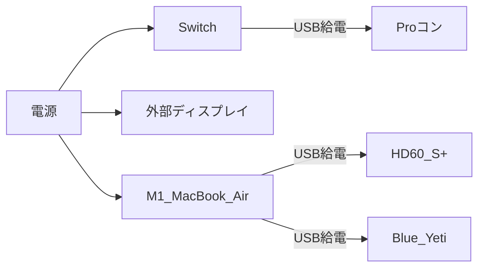
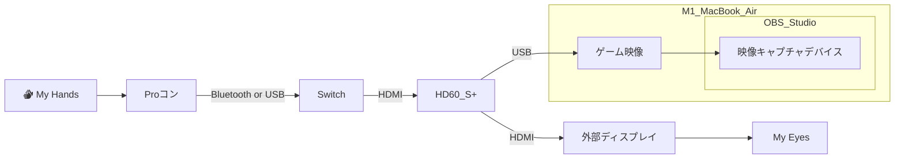
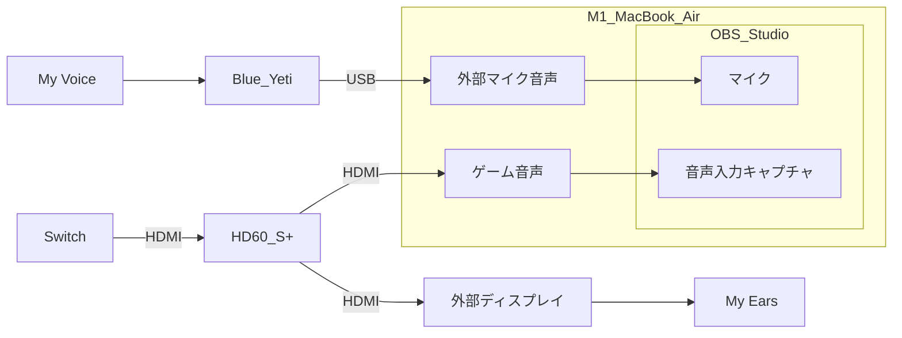
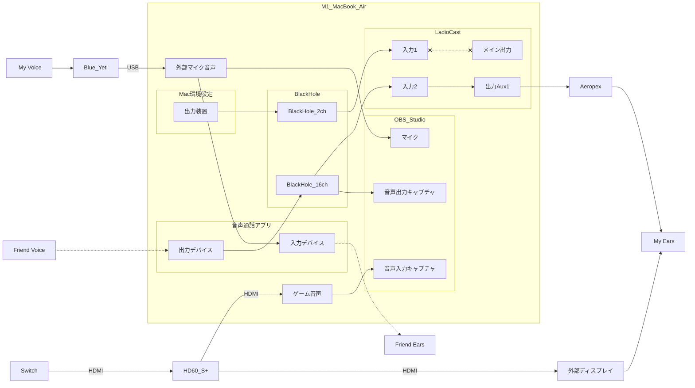

# ゲーム収録環境

## 電源供給

```mermaid
flowchart LR
  電源 --> Switch
  電源 --> 外部ディスプレイ
  電源 --> M1_MacBook_Air
  Switch -- USB給電 --> Proコン
  M1_MacBook_Air -- USB給電 --> HD60_S+
  M1_MacBook_Air -- USB給電 --> Blue_Yeti
```

## 操作入力と映像出力

```mermaid
flowchart LR
  hands[fa:fa-hands My Hands] 
  Proコン
  Switch
  HD60_S+
  subgraph M1_MacBook_Air
    ゲーム映像
    subgraph OBS_Studio
      映像キャプチャデバイス
    end
  end
  外部ディスプレイ
  eyes[fa:fa-eyes My Eyes]

  hands --> Proコン -->|Bluetooth or USB| Switch -->|HDMI| HD60_S+
  HD60_S+ -->|USB| ゲーム映像 --> 映像キャプチャデバイス
  HD60_S+ -->|HDMI| 外部ディスプレイ --> eyes
```

## 音声入出力

### 音声通話なし

```mermaid
flowchart LR
  voice[fa:fa-waveform My Voice]
  Blue_Yeti
  Switch
  HD60_S+
  subgraph M1_MacBook_Air
    外部マイク音声
    ゲーム音声
    subgraph OBS_Studio
      マイク
      音声入力キャプチャ
    end
  end
  外部ディスプレイ
  ears[fa:fa-ear My Ears]

  voice --> Blue_Yeti -->|USB| 外部マイク音声 --> マイク
  Switch -->|HDMI| HD60_S+
  HD60_S+ -->|HDMI| ゲーム音声 --> 音声入力キャプチャ
  HD60_S+ -->|HDMI| 外部ディスプレイ --> ears
```

### 音声通話あり

```mermaid
flowchart LR
  voice[fa:fa-waveform My Voice]
  FV[Friend Voice]
  Blue_Yeti
  Switch
  HD60_S+
  subgraph M1_MacBook_Air
    ゲーム音声
    外部マイク音声
    subgraph Mac環境設定
      出力装置
    end
    subgraph 音声通話アプリ
      出力デバイス
      入力デバイス
    end
    subgraph BlackHole
      BlackHole_2ch
      BlackHole_16ch
    end
    subgraph LadioCast
      入力1
      入力2
      メイン出力
      出力Aux1
    end
    subgraph OBS_Studio
      マイク
      音声入力キャプチャ
      音声出力キャプチャ
    end    
  end
  Aeropex
  外部ディスプレイ
  ears[fa:fa-ear My Ears]
  FE[Friend Ears]
  
  出力装置 --> BlackHole_2ch --> 入力1 x-.-x メイン出力
  
  voice --> Blue_Yeti -->|USB| 外部マイク音声
  外部マイク音声 --> 入力デバイス -.-> FE
  外部マイク音声 --> マイク

  FV ..-> 出力デバイス --> BlackHole_16ch
  BlackHole_16ch --> 入力2 --> 出力Aux1 --> Aeropex --> ears
  BlackHole_16ch --> 音声出力キャプチャ

  Switch --->|HDMI| HD60_S+
  HD60_S+ -->|HDMI| ゲーム音声 --> 音声入力キャプチャ
  HD60_S+ -->|HDMI| 外部ディスプレイ --> ears
```
